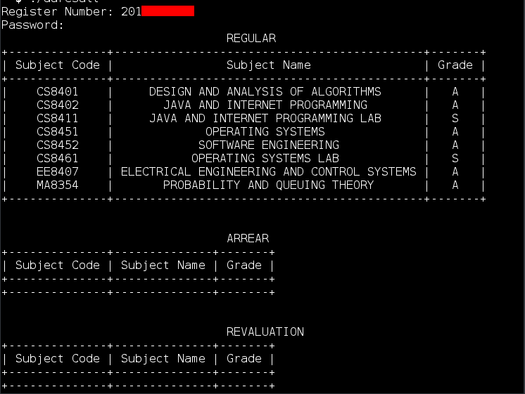

# ACOE Result on command line (View Result only)

# Installation

## Preinstallations

$ `sudo apt update`

$ `sudo apt -y install python-pip`

$ `sudo pip install BeautifulSoup4`

$ `sudo pip install lxml`

$ `sudo apt install python-prettytable`

## Installing from this repository

To download this repository, you may either clone via git:

$ `git clone https://github.com/prabhakaran9397/auresult/`

$ `cd auresult`

$ `chmod 777 auresult`

or download a source code: [auresult](https://github.com/prabhakaran9397/auresult/archive/master.zip).

### Running the command

$ `./auresult`

`Register Number: 201XXXXXXX`

`Password: `

